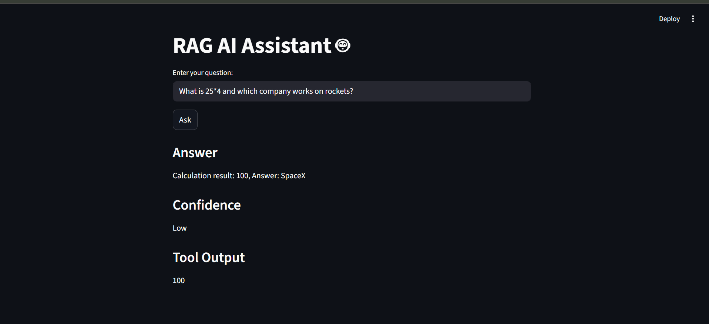

# RAG Streamlit UI

## Overview
This project builds a Streamlit-based user interface for interacting with a production-level RAG API system.

## Features
- User-friendly interface for querying RAG system
- Displays answer, confidence score, and tool output
- Connects to FastAPI backend

## How It Works
User → Streamlit UI → FastAPI → RAG System → Response

## How to Run

1. Start FastAPI server:
```bash
uvicorn app:app --reload
```
2. Run Streamlit UI:
```bash
streamlit run app_ui.py
```

### Note

Make sure the FastAPI backend is running before starting the UI.

## UI Preview


